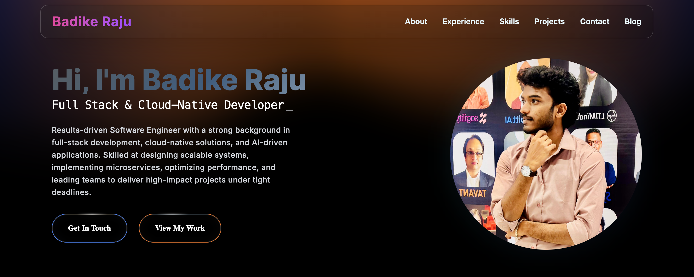

# 🌟 Badike Raju's Portfolio

Modern, responsive portfolio for Badike Raju — Software Engineer with strengths in full-stack development, cloud-native architectures, and AI/ML-driven solutions.



## 🚀 Live Demo

🔗 **[View Live Site](https://badikeraju.github.io/Raju-Portfolio/)**

## ✨ Highlights

- Full-stack focus: React frontends + Node/Express backends
- Cloud & DevOps: AWS, Firebase, CI/CD, Docker
- AI/ML: RAG, OpenCV, FAISS, GPT/Mistral integrations
- Clean UI with Tailwind + Framer Motion animations

## 🛠️ Tech Stack

- **Frontend:** React 18, Tailwind CSS, Framer Motion
- **Backend:** Node.js, Express.js
- **Data:** MongoDB, MySQL, Firebase/Firestore
- **Build:** Vite, ESLint

## 📦 Setup

Prereqs: Node.js ≥ 16 and npm or yarn.

```bash
git clone https://github.com/BadikeRaju/Raju-Portfolio.git
cd Raju-Portfolio
npm install
npm run dev
```

Visit `http://localhost:5173` during development.

### Available Scripts

- `npm run dev` – start dev server with HMR
- `npm run build` – production build
- `npm run preview` – preview the prod build locally
- `npm run lint` – run ESLint

## 🏗️ Project Structure

```
Raju-Portfolio/
├── public/                 # Static assets (images, resume, fonts)
├── src/                    # React source
│   ├── components/         # UI sections
│   ├── App.jsx             # Root layout
│   └── main.jsx            # Entry point
├── package.json            # Dependencies & scripts
├── vite.config.js          # Vite configuration
└── README.md               # Documentation
```

## 🔧 Configuration

`vite.config.js` sets the GitHub Pages base path:

```javascript
base: process.env.VITE_BASE_PATH || "/Raju-Portfolio";
```

Update `VITE_BASE_PATH` when deploying to a different path/domain.

## 🚀 Deployment

1) Build: `npm run build`  
2) Deploy `dist/` to your host (GitHub Pages, Vercel, etc.).  
For GitHub Pages, keep the base path in sync with the repo name.

## 📧 Contact

- **Email:** rajubadike23@gmail.com
- **LinkedIn:** https://www.linkedin.com/in/raju-badike
- **GitHub:** https://github.com/BadikeRaju

If this project helped, a ⭐ is always appreciated!
